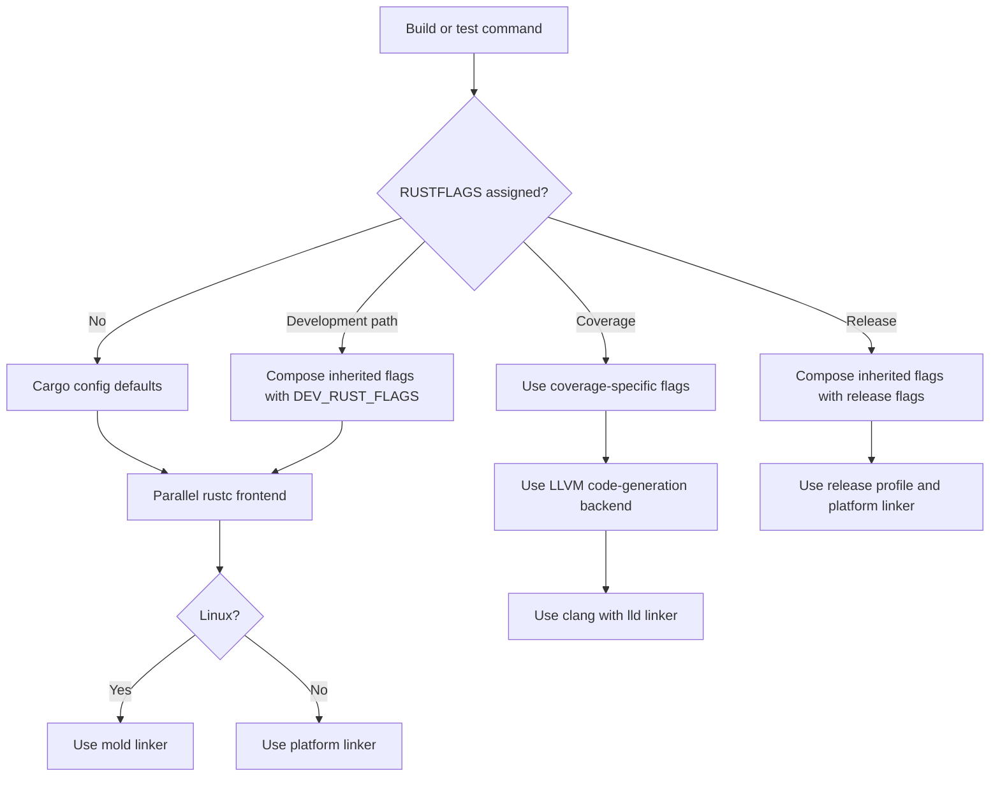

# Developer Guide

This guide explains the contributor workflow for the generated Mornington
project.

## Design baseline

Read the
[terms of reference](terms-of-reference.md), [technical design](mornington-design.md),
and [storage ADR](adr-001-behavioural-storage-ports.md) before adding
application features. These describe the target system; the source remains
generated scaffolding. The design owns proposed internal interfaces and port
composition. Only adapter modules, their tests, and the composition root may
name RouchDB or redb types. Test the same behavioural contracts in memory and
durable modes when implementing storage.

## Local Workflow

Use `make all` as the public entrypoint for formatting, linting, and tests. It
recurses through each cache-consuming gate in order, even under `make -j`.
`make lint` runs rustdoc and Clippy, Whitaker, and the Python gateway in that
order. The Python gateway runs Ruff, Pylint with all pinned `df12-python-lints`
messages, ambrleaks, and Interrogate on every repository Python module under
`.github`, `tests`, `scripts`, `benches`, and `benchmarks`. `make test` runs
the Python workflow contracts before it prefers `cargo nextest run` and falls
back to `cargo test` when cargo-nextest is not available. `make check-fmt`
verifies Rust formatting with `cargo fmt --all -- --check` and Markdown
formatting with `mdtablefix --check --git --include-untracked`, and checks
Python formatting with Ruff. `make fmt` formats Rust and Python sources before
formatting Markdown with `mdtablefix --in-place` followed by
`markdownlint-cli2 --fix`. `make typecheck` runs ty on the same Python
inventory and checks Rust without building via `cargo check`. Every Python tool
uses managed CPython 3.14. `make audit` derives the Rust workspace root with
`cargo metadata`, logs workspace member manifests, and runs `cargo audit` once
from the workspace root. PR CI skips `make audit` and the audit-only setup when
`github.actor` is `dependabot[bot]`; that keeps whole-lockfile advisories from
blocking unrelated Dependabot PRs while human PRs retain the audit gate. The
compensating control is `.github/workflows/audit.yml`, which runs weekly and
can also be triggered manually. `make coverage` uses `cargo llvm-cov` with
`lld`.

GitHub Actions Act validation lives in `.github/workflows/act-validation.yml`.
The main `.github/workflows/ci.yml` workflow deliberately does not run
`make test WITH_ACT=1`; the separate Act workflow runs those slower
container-backed checks in parallel. For opt-in local validation, install Act
and Docker before running `make test WITH_ACT=1`: this path invokes Act against
`.github/workflows/ci.yml` and executes its `build-test` job in Docker. The
Makefile maps `ubuntu-latest` to `catthehacker/ubuntu:act-latest` so Act does
not prompt for an image interactively. Outer Cargo tests still link on the host
first, so the host must provide the configured `clang` and `mold` linkers even
though the CI job runs in a container.

A scheduled `.github/workflows/mutation-testing.yml` workflow also runs
`cargo-mutants` via the shared reusable workflow, daily and on manual dispatch.
It is informational and does not gate pull requests. Dependabot keeps its
pinned reusable-workflow SHA current. See the user guide's "Scheduled Mutation
Testing" section for behaviour, and promote surviving mutants into new tests.

`coverage-main.yml` measures coverage on pushes to `main` and on dispatch from
`main`, and is the only CodeScene caller; `ci.yml` measures pull requests for
their own ratchet, at the same `generate-coverage` revision with
`publish-artefact: 'false'`, and names no CodeScene token, host or command. The
publisher's concurrency group is `${{ github.workflow }}-${{ github.ref }}` with
`cancel-in-progress: false`. GitHub may replace a pending run, but that queue
behaviour does not prove which trigger eventually publishes.

The uploader runs only for a `main` ref and receives `CS_ACCESS_TOKEN` through
its `access-token` input when the availability check succeeds. The checked-in
workflow names the protected `codescene` environment, but repository files do
not prove that the environment admits a ref or that its token is provisioned. A
manual dispatch can rerun coverage, while `publish-baseline: auto` writes the
ratchet baseline only for a push; a dispatch leaves the baseline unchanged.
`make test-workflow-contracts` runs the shared CV-005 contracts against the
committed workflows. The repository-specific pairing is recorded in
`.github/cv005.toml`; a change to shared contract policy is consumed by
updating the full commit pinned in the Makefile.

## Lint baseline

`Cargo.toml` holds the project lint policy and `clippy.toml` holds its numeric
thresholds and disallowed APIs. The baseline comes from Concordat
`8a4a1faba1290687c0b6b221e1fc96439ba3ba43`, including `rust-build-defaults`
0.1.1; this repository extends it with the measured, zero-finding
`clippy::missing_docs_in_private_items` denial. New workspace members must
inherit the same Cargo lint tables and root Clippy configuration.

Fix findings at their source. A narrowly scoped exception needs a reason and
must preserve the rule everywhere else. Keep cognitive complexity at 9,
arguments at 4, lines at 70, and nesting at 4. Inject environment access through
`mockable::Env` rather than reading or mutating the process environment
outside the production composition root. The dated toolchain and its required
components are recorded in `rust-toolchain.toml`; run
`make install-build-tools` and `make check-build-tools` before development
builds on a fresh checkout.

### Polonius borrow checker

This project compiles with the Polonius alpha analysis (`-Zpolonius=next`) on
the dated nightly pinned in `rust-toolchain.toml`. `.cargo/config.toml`
supplies the flag by default; Makefile recipes and workflows that set
`RUSTFLAGS` must re-state it because the environment value overrides Cargo
configuration. See [the Polonius policy](polonius.md) for the borrow-centric
API and audit-tag conventions.

Generated CI and coverage workflows, plus the release workflow rendered for
applications, pass this base flag through the shared `setup-rust` action's
`rustflags` input. Library renders do not include `release.yml`. The pinned
revision must expose that input, and coverage overrides must repeat the
selected base flag alongside their `lld` linker flag. Contract tests should
assert these inputs and combined flags.

Development builds use Cranelift for debug code generation. On Linux targets,
`.cargo/config.toml` configures clang to link with `mold` so debug builds link
quickly. Coverage generation uses `lld` because LLVM coverage tooling expects
LLVM-compatible linker behaviour.

Install `clang`, `lld`, `uv`, and `cargo-audit`, then run
`make install-build-tools`, before running the full generated workflow locally
on Linux.

## The build standard

Development, test, lint, and typecheck builds use the parallel `rustc` frontend
(`-Zthreads=8`) and, on Linux, the `mold` linker (`-Clink-arg=-fuse-ld=mold`).
These are defaults in `.cargo/config.toml`, which Cargo discovers on its own,
so a bare `cargo build` gets them. `mold` ships for Linux only, so the linker
flag lives in a Linux-only table and macOS and Windows keep their platform
linker. Cargo selects one `rustflags` source rather than merging them, so every
source repeats the same flags apart from the linker.

An assigned `RUSTFLAGS` replaces the configuration's flags, so the Makefile
recipes that set it compose the standard's flags onto any inherited value (CI's
`setup-rust` exports one). Two builds are deliberately excluded: coverage
assigns `RUSTFLAGS` without the fast flags, because a measurement should not
depend on them, and the release recipe and workflow keep the platform linker,
because they assign `RUSTFLAGS` (even an empty value displaces the
configuration). Cargo has no per-profile `rustflags`, so a direct
`cargo build --release` takes the configuration's flags unless `RUSTFLAGS` is
assigned too.

**Figure 1: Rust flag and linker selection for build and test commands.**



The diagram separates the coverage backend from its linker: LLVM generates
instrumented code, while `lld` links it. Release retains warning denial and
Polonius, but leaves out the development-only parallel frontend and `mold`
flags.

On Linux, install `mold` before building: the configuration names it, so a
build without it fails at link time. CI installs it through `setup-rust`'s
`install-mold` input. `tests/build_standard_contract.rs` holds the standard. It
reads the configuration sources, the commands `make -n` prints for each
development target on a Linux host and a macOS host (each keeping the caller's
own `RUSTFLAGS`) and for each coverage and release target on a Linux host, and
the `setup-rust` steps of the CI workflows (each must pass `install-mold`), so
a flag lost through a recipe or workflow edit fails there.
`tests/build_standard_support/ci_steps.rs` owns its `Workflow` reader as
test-only repository-CI YAML code; it is not an application or shared parsing
API. `tests/build_standard_support/workflow_routes.rs` and its private runner
sibling own only test-contract interpretation of GitHub Actions runner forms;
they are not reusable workflow-parsing APIs.

### Cranelift

Cranelift is the development-profile codegen backend. Final integrated
validation must run the full suite on the pinned nightly before recording a
passing result. Coverage selects LLVM explicitly
(`CARGO_PROFILE_DEV_CODEGEN_BACKEND=llvm`), because instrumentation needs it,
and release builds use the release profile, which Cranelift does not touch.
Re-measure the whole suite on the next toolchain bump; if it fails, record the
failing tests here as an exception and remove the backend from
`.cargo/config.toml`.

## Spelling policy

Markdown uses en-GB-oxendict spelling enforced by the shared
`typos-config-builder` gate. Run `make spelling`.

`typos.toml` is generated, tracked output. The gate regenerates it on every run
from the live shared estate dictionary and the `typos.local.toml` overlay, so a
word added to the shared dictionary needs no change here. Commit regenerated
output with spelling-policy changes, but never hand-edit it. Because the
dictionary is live, continuous integration must not drift-check `typos.toml`.
Add narrow repository-specific identifier, API, proper-name, or fixture
exceptions to `typos.local.toml`; hand edits are overwritten on the next run.

### Security audit ignores

Security audit jobs may set `CARGO_AUDIT_IGNORES` for narrowly scoped RustSec
advisories that affect unused or tooling-only dependency paths. Keep each
ignore tied to a documented runtime impact analysis, and remove it when the
affected dependency leaves the graph or the project starts using the advised
runtime path.

## Workflow pins and Dependabot

Dependabot owns the upgrade of GitHub Actions and reusable workflows, including
calls into `leynos/shared-actions`. Contract tests that assert a caller's exact
commit SHA create a lockstep dependency: every time Dependabot opens a bump PR,
the test fails until a human edits the pinned constant to match. That defeats
the purpose of automated dependency updates and turns a routine bump into a
manual chore.

`.github/dependabot.yml` updates the root Cargo manifest and GitHub Actions
daily. Each entry ends with the minor-and-patch catch-all group, leaving majors
outside any narrower lockstep group in their own pull request.

Dependabot owns the shared `setup-rust` commit pin. Its build-standard contract
checks the shared action path and requires every setup step to pass
`install-mold: 'true'`; it does not pin or assert a particular revision. The
`INSTALL_WHITAKER_ACTION` exception still pins the allowlisted strict Whitaker
installer because that revision is a policy boundary rather than a routine
dependency update.

Contract tests may still verify the *shape* of a reusable-workflow caller. They
must not verify the specific SHA value.

- Do assert the workflow references the correct reusable workflow path.
- For `setup-rust`, do assert the expected shared action path and required
  inputs, while leaving the revision value to Dependabot.
- Where an independent policy requires immutable action refs, assert the ref
  shape without copying one fixed revision into the contract.
- Do assert the expected `on:` triggers, least-privilege `permissions:`, and
  the inputs the caller relies on.
- Do not hard-code the current SHA value as an expected string. Match it with
  a pattern instead.
- Do not fail a test purely because Dependabot bumped the pinned SHA.

```python
import re

SHA_RE = re.compile(r"^[0-9a-f]{40}$")

def test_uses_pinned_full_sha(caller_step):
    ref = caller_step["uses"].split("@")[-1]
    assert SHA_RE.match(ref), f"expected a 40-hex commit SHA, got {ref!r}"
```

If a workflow's behaviour genuinely depends on a feature only present from a
particular commit onwards, express that as a comment or a changelog note, not
as a test assertion on the SHA string. The strict allowlisted
`INSTALL_WHITAKER_ACTION` remains policy-pinned; the shared `setup-rust` action
continues to use Dependabot's revision.

## Act validation linker prerequisites

The Act validation workflow provisions pinned `mold` through `setup-rust`,
installs and probes `clang`, then runs `make check-build-tools` before
`make test WITH_ACT=1`. Cargo links the outer test binaries using the
repository's Linux linker configuration before any nested Act jobs can run.
Container-local packages cannot satisfy this host requirement. The workflow
ordering contract is covered by `tests/act_workflow.rs`. The nested Act run
disables the shared `setup-rust` sccache accelerator. It skips coverage and
artefact upload because Act containers cannot provide the GitHub Actions cache
or runtime-token services those steps require. It runs `make test` instead;
normal CI retains sccache and coverage.

## Markdown formatting

Markdown follows Concordat `8a4a1faba1290687c0b6b221e1fc96439ba3ba43`'s
`markdown-formatting-baseline` 0.2.0 rule.

- `make fmt` rewrites Markdown with
  `mdtablefix --in-place --git --include-untracked --wrap --renumber --breaks
  --ellipsis --fences`,
  then runs `markdownlint-cli2 --fix "**/*.md"`.
- `make check-fmt` runs the same mdtablefix command with `--check` in place of
  `--in-place`, and fails when any file would change.
- `--git --include-untracked` selects the Markdown files Git tracks plus the
  untracked files Git does not ignore, so a new document is checked before it
  is staged.
- `.markdownlint-cli2.jsonc` carries the canonical markdownlint configuration:
  MD010 excludes code blocks, while MD013 enforces 80-column prose and
  120-column code blocks without wrapping headings or tables. These distinct
  settings are not interchangeable.
- CI installs mdtablefix 0.6.0 with the shared `install-mdtablefix` action
  before `make check-fmt`, and lints Markdown with
  `DavidAnson/markdownlint-cli2-action` over `**/*.md`.

Install mdtablefix 0.6.0 or later locally with
`cargo binstall --no-confirm mdtablefix@0.6.0`, or
`cargo install --locked mdtablefix@0.6.0`. Install markdownlint-cli2 0.23.3 with
`bun add --global markdownlint-cli2@0.23.3` or
`npm install --global markdownlint-cli2@0.23.3`.

## Spelling configuration

`make spelling` uses `typos-config-builder` v0.1.3's supported `gate`
subcommand. It regenerates tracked `typos.toml`; commit that output when this
spelling migration changes it, never hand-edit it, and do not add a drift check
for it. Put narrowly scoped Mornington terms in `typos.local.toml`. The
baseline was selected from Concordat `8a4a1faba1290687c0b6b221e1fc96439ba3ba43`
under `spelling-config-baseline` 0.1.0. Its observed shared-dictionary content
has SHA-256 `d67b4110813615a4eda3e8962e898466191e4af25b2e28baedcbab348696aeac`.

The prior blanket inline-code exclusion was removed: spelling policy now reads
inline code and accepts only repository-specific exceptions in the overlay.

## Build tool prerequisites

`make install-build-tools` installs the dated nightly toolchain and its listed
components, then downloads mold 2.41.0 from its release archive only after the
repository-pinned SHA-256 matches. It never compiles or installs mold through a
package-manager fallback. `make check-build-tools` verifies the toolchain,
components, clang, and the exact mold version before each development target.
`make check-coverage-tools` additionally requires `ld.lld`.

CI uses the strict Whitaker provisioner pinned at
`6dea5677a84fec60ca51b07202570e3af12ffdb4`, as allowlisted by
`whitaker-provisioning` 0.1.0. The action's current live descendant was
inspected at `d4d248bbbecdcf7b4f5bc79ffd4d6caee370bd79`; it rejects suite
overrides and uses no source fallback. Whitaker runs without the development
`RUSTFLAGS` injection.
