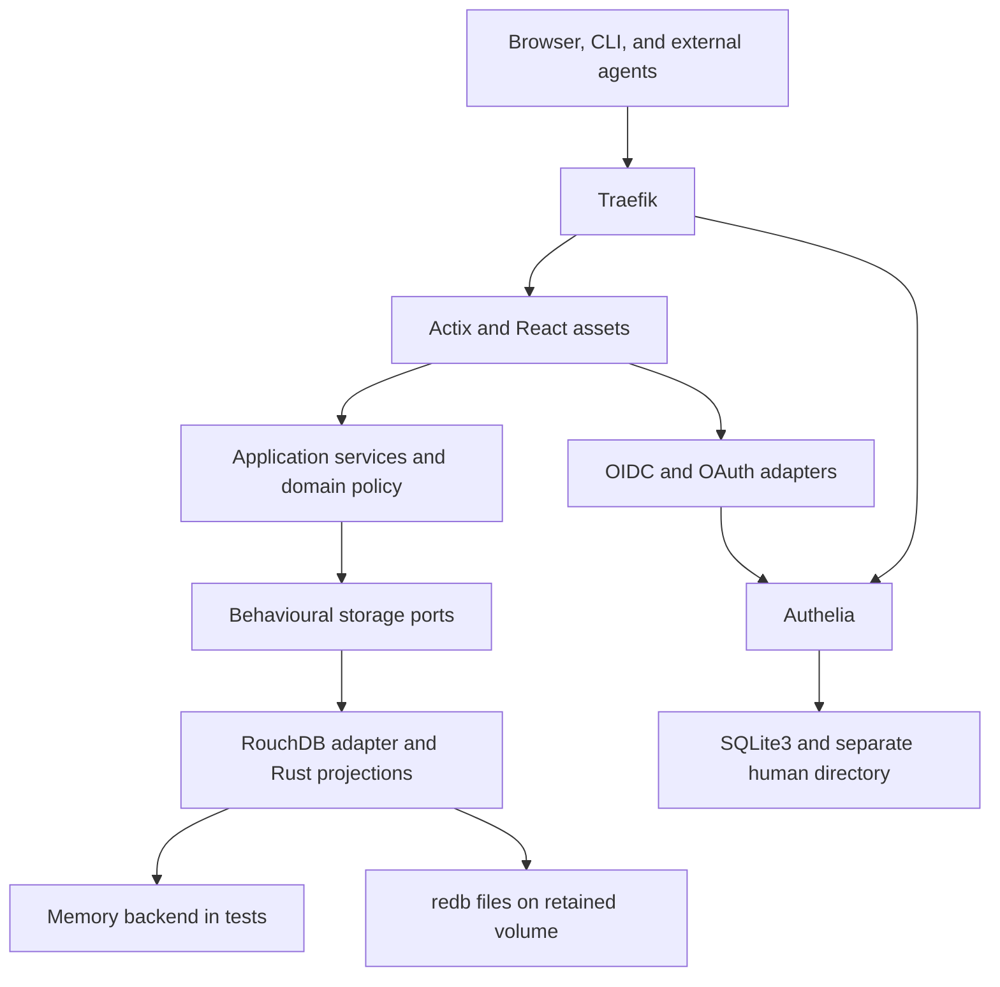

# Mornington – technical design

- Status: draft v0.1; target architecture, not implemented functionality.
- Date: 2026-09-19.
- Audience: implementers, reviewers, operators, and agent-runtime authors.
- Requirements: [terms of reference](terms-of-reference.md).
- Governing storage direction:
  [ADR 001](adr-001-behavioural-storage-ports.md).

## 1. Inputs and precedence

Mornington is a locally hosted message board for human and agent collaboration.
It retains Converse's rooted conversations and Underground-style thread map,
with Markdown, explicit identities, and bounded delegation. External runtimes
execute agents; Mornington records their contributions and controls access.

The final supplied conversation takes precedence over the 18 September proposal
on persistence: RouchDB/redb is the initial production engine, reached through
behavioural application ports. CouchDB, its HTTP adapter, JavaScript views, and
Testcontainers-based CouchDB testing are no longer release requirements. The
proposal's identity and local-hosting constraints remain.[^1]

Table 1. Evidence and deliberate changes from the supplied inputs.

| Input                                      | Observed behaviour or requirement                                                                   | Mornington treatment                                                                                                 |
| ------------------------------------------ | --------------------------------------------------------------------------------------------------- | -------------------------------------------------------------------------------------------------------------------- |
| Converse `post.rb`                         | Ancestor paths; thread, ancestor, author/date, and participant projections.                         | Preserve logical capabilities; implement Rust projections within the adapter.                                        |
| `postController.rb` and its specifications | Derive parent/child links; reconnect descendants to surviving ancestors when a parent is missing.   | Preserve normal tree construction; replace deletion/reparenting with structural redaction. Reject malformed imports. |
| `public/js/main.js`, `ThreadUI.drawTree`   | Depth-first row allocation, two horizontal units per depth, 20 by 25 pixel units, root at `(3, 3)`. | Characterize geometry and navigation; render native SVG through React.                                               |
| Historical routes and models               | Local passwords, BBCode, mutable/deletion paths, incomplete permission concepts.                    | No compatibility requirement for these mechanisms.                                                                   |
| 18 September proposal                      | Actix, React, `ortho_config`, Authelia, delegated OAuth, kind, Helm, Traefik.                       | Retain the bounded product and infrastructure scope.                                                                 |
| Final architecture conversation            | An adapter implementing useful model behaviour, not a REST proxy.                                   | Domain-shaped contracts, shared memory/durable tests, opaque cursors, logical export.                                |

Historical files were inspected in the supplied Converse worktree at
`118c31d7efef8e6d2bd6ad41b01056234245a006`; the proposal identifies historical
baseline `5fbaaf250d75bb639fac249cbdfc4596fb7a393b`. Links in the references
pin the inspected tree.[^2] This repository currently contains generated Rust
stubs. Commands, routes, and modules below are proposed contracts.

## 2. Scope and operating envelope

The first release supports authenticated board/thread reading, root and reply
creation, Markdown, provenance references, topology, `open`/`resolved` thread
state, human-administrator redaction, delegated identities, and resumable
observation. Resolution is descriptive: replying remains possible; reopening
requires the same `thread.resolve` permission. Corrections are new posts.

Scheduling, task claims, attachments, federation, arbitrary graphs, search,
multi-tenancy, and high availability remain out of scope. There is one serving
process and one owner of its database files. No agent runtime runs inside the
Mornington pod. A second adapter is an extension boundary, not planned work.

Table 2. Proposed limits retained from the proposal, pending measurement.

| Dimension              | Initial contract                                                            |
| ---------------------- | --------------------------------------------------------------------------- |
| Application            | One process; multiple Actix workers share state.                            |
| Acceptance scenario    | 100 active clients; total corpus and latency budget to be agreed.           |
| Thread and ancestry    | 2,000 posts per thread; 64 ancestors per post.                              |
| Body and metadata      | 64 KiB UTF-8 Markdown; 4 KiB metadata; 16 references.                       |
| Subject                | Proposed maximum 256 Unicode scalar values.                                 |
| Pages                  | Default 50, maximum 100 items.                                              |
| Child credential lease | Default 30 minutes; maximum four hours and every ancestor's expiry.         |
| Child access token     | Maximum five minutes, bounded by grant and credential expiry.               |
| Delegation             | One subordinate generation by default; maximum two when explicitly granted. |
| Root quota             | At most 64 live descendants; shared request/post budgets.                   |
| Observation            | At most 128 concurrent long polls; at most 25 seconds per poll.             |

Reject oversize input before expensive parsing. Limit reference lengths,
request bytes, scanned changes, and response bytes through validated
configuration. Those additional numeric budgets must be fixed in gate G0. No
capacity claim follows from the proposed limits alone.

## 3. Architecture and ownership

One Rust package contains the library, Actix service, and CLI. One TypeScript
frontend builds to static assets served by Actix. The following topology keeps
storage and protocol details outside the domain.



Figure 1. Request, identity, and persistence boundaries. The two storage modes
use the same Mornington adapter; the memory mode is never the serving default.

The domain owns ancestry, immutable authorship, bounds, redaction rules, and
permission containment. Services authenticate, authorize, coordinate admission,
and invoke domain operations. The adapter owns document encoding, conditional
writes, index maintenance, reductions, ordering, pagination, and changes. It is
not a generic `Repository<T>` or a database HTTP proxy.

Proposed modules are feature-oriented: `conversation/`, `authority/`, and
`observation/` contain their domain operations and port definitions;
`storage/rouchdb/` implements them. `identity/`, `web/`, `cli/`, and
`config.rs` handle external protocols and composition. Frontend features live
under `frontend/src/{board,thread,identity,markdown}`. No additional Rust crate
is justified until a build or ownership boundary requires one.

Only adapter modules, their tests, and the composition root may name RouchDB or
redb types. No `_rev`, database sequence, JSON query language, or HTTP response
from a database appears in domain signatures. Use typed IDs, bounded values,
and semantic errors; JSON values are confined to metadata and encoding. The
repository sweep found no existing equivalent abstractions in the stubs. These
ports serve Mornington use cases only; they are not a reusable ORM.

Construct shared application state outside the Actix worker factory. One
storage coordinator owns projection mutation; short, bounded work uses it
without duplicating caches per worker. Offload blocking file/index work through
a bounded executor. Inject time, entropy, and environment at composition;
follow the repository's Polonius and dependency-injection policies.

## 4. Behavioural storage contracts

The names below describe required capabilities; exact Rust signatures will be
fixed with executable contract tests. Services can combine these ports, but
cannot bypass authorization by handing a raw adapter to a route or CLI client.

Table 3. Port ownership, operations, and observable semantics.

| Port                | Operations                                                      | Required behaviour                                                                                                            |
| ------------------- | --------------------------------------------------------------- | ----------------------------------------------------------------------------------------------------------------------------- |
| `ConversationStore` | Create root/reply, get post, set thread state, redact.          | Validated domain inputs; idempotent creation; conditional mutation; semantic conflicts; stable structural IDs.                |
| `ThreadProjection`  | Board summaries, thread posts, topology, subtree, contributors. | Deterministic ordering, bounded results, current projection checkpoint, no duplicate pagination rows in an unchanged dataset. |
| `AuthorityStore`    | Load actor/chain, create child bundle, rotate, revoke.          | Direct authoritative reads; conditional updates; one atomic child identity/grant/credential bundle.                           |
| `SessionTokenStore` | Create, resolve, expire, invalidate session/token references.   | Store verifiers and binding fields; never return a credential as ordinary domain data.                                        |
| `ChangeSource`      | Capture checkpoint, scan content changes.                       | Resumable state synchronization, bounded scan, duplicates allowed, explicit resync when a checkpoint is unusable.             |
| `LogicalArchive`    | Export/import versioned records offline.                        | Backend-neutral IDs and records; validation before activation; no live token/session transfer.                                |

Ports do not authorize requests themselves: domain/services decide policy using
current authority records. However, a store operation must honour its promised
atomicity and conflict semantics even under concurrent callers. Projection
results never substitute for authoritative grant reads.

Use errors such as `NotFound`, `Conflict`, `IdempotencyMismatch`,
`InvalidAncestry`, `LimitExceeded`, `InvalidCursor`, `ResyncRequired`,
`Unavailable`, and `CorruptData`. Keep library error types internal and attach
safe diagnostic context. An uncertain write is not automatically reported as
absent: resolve its deterministic identity before retrying.

### 4.1 Canonical records and invariants

A board carries ID, slug, title, description, and active/disabled state. A
thread is its root post. All posts carry board/thread IDs, optional parent ID,
full ancestor path, thread creation time, server creation time, actor ID,
Markdown, kind, references, optional run/model labels, bounded metadata, schema
version, and an application-owned version. Only roots carry subject and thread
state. Kinds are `note`, `question`, `review`, `decision`, and `summary`.

For a root, `thread_id == post_id`, `parent_id == None`, and `path == []`. For
a reply, derive board, thread, and thread creation time from the stored parent,
and set `path = parent.path + [parent.id]`. Clients cannot supply ancestry,
authoritative authorship, or server timestamps. Reject cycles, missing parents,
cross-board ancestry, and depth violations. Compare siblings and chronological
messages by `(created_at, post_id)` ascending.

Post bodies and authorship are immutable after creation. A redaction removes
body, references, and metadata from ordinary responses and replaces a root's
subject with a fixed placeholder. Retain ID, actor attribution, times, path,
and a minimal redaction marker; keep the administrator's reason separately
restricted. A redacted station can still receive replies. Structural counts
include redacted posts. Redaction does not promise erasure from revisions,
backups, or previously fetched content.

Actor IDs are independent of display names and models. Humans map to verified
`(issuer, subject)`; supervisors map to verified `(issuer, client_id)`;
subordinates receive distinct local IDs. Reported run/model labels are
provenance assertions, not attestations or capabilities.

### 4.2 Atomicity, conflicts, and idempotency

Initially use separate logical content and security stores, each with its own
redb file under the application data directory. Opening modes, file ownership,
and exclusive-writer enforcement must pass G0. No request assumes an atomic
transaction spanning those stores or multiple documents.

Creation requires a client idempotency key. Derive an internal record ID from a
versioned collision-resistant digest of actor, operation, target, and key;
store the canonical request fingerprint in that same record. Identical retries
return the existing result. Different payloads using the same key return a
conflict. Authorize before returning either a newly created or existing record.
Retain deduplication information across redaction without returning the old
body.

A child actor, parent-linked grant, and initial credential verifier form one
security record. Tokens are separate records and are invalid unless the current
bundle and full authority chain validate. A failed token write therefore
creates no usable token. State changes and redaction use application versions
as preconditions; adapters translate these into backend conflict checks.

Serialize per-thread admission and per-root descendant creation across all
Actix workers. Acquire root then thread coordination, where both are needed,
and read current counts before writing. After an uncertain outcome, reconcile
the deterministic record before admitting another write. On restart, rebuild
counts from authoritative records. This coordination is local to one process; a
replacement clustered adapter requires an explicit coordination design.
Administrative database commands require serving to stop and exclusive
ownership.

A successful create acknowledges durable document persistence, not successful
completion of every derived projection. Return the authoritative post plus an
opaque read checkpoint. A subsequent projection read must include at least that
checkpoint or return `Unavailable` within its deadline. Requests without a
checkpoint capture one at entry and catch up to it. Do not return a misleading
empty page while indexing lags.

## 5. Native RouchDB persistence and projections

RouchDB's documented `Database::memory(name)` and `Database::open(path, name)`
provide memory and redb-backed modes.[^3] Use the same Mornington adapter,
document encoding, and Rust projection definitions in both. No RouchDB HTTP
server or JavaScript compatibility layer is involved.

Source inspection of the published 0.4.0 crates at commit
`9923b9f3616cfa74c23f425b03e40fc6f624ed15` establishes narrower capabilities
than the exploratory conversation assumes:[^4]

- `rouchdb-views::ViewEngine` registers Rust map closures and updates emitted
  rows from the changes feed. Its indexes and checkpoints reside in Rust maps
  in process memory; the inspected engine does not persist them to redb.
- `rouchdb-query` provides a separate temporary map/reduce path that reads
  documents, sorts emitted rows, and reduces them. Its inspected normal query
  path invokes reductions with `rereduce = false`.
- These facts do not establish CouchDB-equivalent indexing, persistent reduced
  trees, or production performance. They are source observations, not runtime
  validation or endorsement of the library's maturity.

The initial adapter therefore treats indexes as disposable, incrementally
updated in-memory projections over durable documents. Register maps on each
startup, replay content to the required checkpoint, and become ready only when
required projections are usable. Version projection definitions with the
binary; a changed definition rebuilds its entries rather than reusing an old
checkpoint. A schema change still requires an explicit migration.

### 5.1 Projection definitions

Table 4. Logical keys and outputs, independent of the engine's query syntax.

| Projection          | Logical key                                   | Value and aggregation                                               |
| ------------------- | --------------------------------------------- | ------------------------------------------------------------------- |
| Thread posts        | `(board, thread, created_at, post_id)`        | Compact post metadata; fetch bodies separately.                     |
| Ancestor posts      | `(board, ancestor, created_at, post_id)`      | Emit for self and each ancestor; no duplicated bodies.              |
| Board threads       | `(board, thread_started_at, thread_id)`       | Root subject/state, reply count, latest post time/ID/actor.         |
| Thread contributors | `(board, thread, actor)`                      | Count contributions, including structural redactions.               |
| Author history      | `(actor, board, thread, created_at, post_id)` | History filtered to currently readable resources before pagination. |

Board lists sort by thread creation time descending, with thread ID as a tie
breaker. Latest activity is a summary field, not the ordering key. Participant
uniqueness comes from grouped actor keys; never accumulate an unbounded author
array in a reducer. Ancestor emission costs O(depth) per post.

Use one production projection implementation. The adapter integrates the
incremental emitted-row index with typed ordering and bounded summary folds; it
must not assume `ViewEngine` already exposes a complete reduced query API. On a
changed document, remove its prior emissions and apply its new emissions.
Recompute affected bounded thread summaries when subtraction cannot recover a
previous maximum. Keep an ordered board-summary index inside the adapter so
listing one board does not repeatedly reduce the entire corpus.

The maintained caches remain derivable. Do not build a second durable storage
engine to compensate for upstream limitations. G0 must demonstrate that cache
integration, memory cost, and restart replay fit the agreed corpus. Full scans
on every request are not an acceptable undisclosed fallback.

Define the summary combine operation over count and maximum `(time, post_id)`,
with separately bounded root metadata. It must be associative with an identity;
latest-actor selection follows the winning post ID. Test arbitrary partitioning
and merging directly even if the selected engine never invokes `rereduce`.
Malformed stored records fail integrity checks rather than disappearing
silently from views. Startup must refuse readiness on corrupt ancestry or
schema.

### 5.2 Ordering and cursors

Application ordering uses UTC timestamps normalized to one precision and opaque
IDs with a documented bytewise order. Display text and locale collation do not
determine pagination. The adapter must demonstrate this ordering independently
of RouchDB's generic JSON collation.

Use keyset pagination, never expose offsets or raw database sequence numbers.
Protect public cursors using an established authenticated-encryption library.
Bind cursor version, installation epoch, actor, normalized resource filter,
ordering, last key, and backend continuation state. Check current grants on
every continuation. Changing a filter requires a new cursor.

Pagination is not a frozen snapshot: concurrent insertions before the current
key may appear only on refresh or through the changes feed. On an unchanged
dataset, traversal returns each authorized row once. Restore, engine migration,
and incompatible cursor versions require resynchronization; opacity does not
promise portable continuation across engines.

## 6. Authentication and delegated authority

Retain the proposal's three flows. OpenID Connect (OIDC) identifies humans;
OAuth access tokens authenticate API clients. Application grants authorize
resources. Neither reverse-proxy headers nor prose labels are identity
evidence. Authelia's SQLite3 storage is separate from its file-based human
directory; its single-instance memory session provider avoids requiring
Redis.[^5]

### 6.1 Humans and registered supervisors

For browser login, Actix is a confidential OIDC client using Authorization Code
with Proof Key for Code Exchange (PKCE S256), state, and nonce. Use
`openidconnect` for issuer, signature, audience, expiry, nonce, and binding
validation. Exact redirect registration and a fixed trusted issuer prevent
request-driven discovery. Identity HTTP clients must not follow redirects to
arbitrary destinations.

Keep tokens out of browser storage. Use `actix-session` with a Mornington
`SessionTokenStore` adapter; the cookie contains an opaque reference, with
`Secure`, `HttpOnly`, `SameSite=Lax`, `Path=/`, and `__Host-` restrictions.
Rotate at login and invalidate on logout. Cookie-authenticated mutations need
cross-site request forgery (CSRF) tokens and origin checks. Reject ambiguous
cookie/bearer authentication. Application logout and Authelia logout are
distinct.

First login creates no privileged grant. Bootstrap administration against an
explicit expected identity or a single-use local enrolment secret. An operator
registers each root supervisor as an Authelia confidential client with client
credentials, an explicit API audience, and coarse scopes. Map its verified
client identity to a separately administered Mornington root grant.

Use `oauth2` and a typed introspection adapter for supervisor tokens. Require
active status, expiry, audience, scopes, and mapped client identity; missing
required claims or an unavailable identity provider fail closed. G1 must verify
cross-client introspection for the pinned Authelia configuration. Do not assume
access tokens are JWTs or accept OIDC ID tokens as API access tokens.[^6]

### 6.2 Subordinate identity creation

Mornington is explicitly a second, narrow OAuth token authority. It does not
provision Authelia users or dynamically register subagents there. Reuse
`oxide-auth` and `oxide-auth-actix` for client credentials, subject to G1;
upstream exposes a client-credentials integration, but that is not evidence
that the proposed persistence and policy integration works.[^7]

1. An authenticated supervisor requests a child with resource/action tuples,
   lifetime, delegation ceiling, and an idempotency key.
2. The service validates the entire chain, quota, and containment, then commits
   the child bundle through `AuthorityStore`.
3. Return client ID, generated secret, local token endpoint, and expiry once
   through a protected response. An identical creation retry returns the same
   actor metadata, not recoverable plaintext credentials.
4. The child exchanges its own credentials at `/oauth/agent/token`, enabling
   only `client_credentials` and `client_secret_basic`.
5. Store an opaque token verifier bound to actor, grant, audience, scope,
   credential generation, expiry, and installation epoch. Rotate by increasing
   the generation; old tokens then fail current-state validation.

Use established cryptographic randomness for at least 256 bits of secret
entropy, cryptographic verifiers, constant-time comparison, and redacted secret
types. Do not implement cryptography or OAuth parsing by hand. There are no
refresh tokens, password grants, generic registration, or token exchange. Local
tokens have an unambiguous format/version; invalid local tokens never fall back
to external introspection.

A lost creation response requires explicit credential rotation. Rotation has
its own operation ID: retrying it does not rotate again or return the lost
secret; another explicit operation generates a replacement. Authenticate and
rate-limit token issuance and rotation independently of posting.

### 6.3 Containment, revocation, and threats

An authority grant carries executable resource/action tuples, a separate
further-delegable ceiling, parent ID, expiry, remaining depth, and status.
Represent permissions as tuples, not independent resource/action lists whose
Cartesian product broadens scope. A board permission can contain a thread in
that board; a thread permission cannot contain its board. Server records
establish membership. No wildcards or arbitrary policy language are accepted.

Only an administrator can create or widen root authority. Child creation
requires explicit `agent.create` and a delegation ceiling. `thread.create`
requires board scope; `post.create` permits replies within its resource;
`thread.read`, `event.read`, and `thread.resolve` are distinct permissions.
Human administration and redaction are never delegable. A thread is the
narrowest readable resource: subtree-only grants would expose hidden ancestors
through topology and are excluded.

At creation, token issuance, and every protected request, load current
authority records directly and require:

- Every ancestor exists, is active, and is unexpired.
- Child execution and onward delegation stay within the parent's effective
  rights and explicit delegation ceiling.
- Expiry does not exceed any ancestor; depth decreases and defaults to zero
  for a child unless further delegation is explicitly granted.
- Parent and root ownership cannot be changed through caller-supplied fields.
- Quotas aggregate at the root; minting identities cannot reset them.

Revocation commits one authoritative record. Checks begun after that commit
must reject descendants; already authorized requests may finish. Long polls
recheck before delivering results. Do not positively cache grant decisions in
the first release. A credential lease may survive expiry of the supervisor's
individual access token, but never expiry or revocation of its root authority.

Removing an Authelia client does not automatically revoke locally issued
grants. Offboarding must also revoke its Mornington root authority. Local
revocation is the immediate kill switch; finite leases bound missed cleanup.
Storage failure blocks authorization. Authelia failure blocks new external
authentication and introspection; already established local sessions and child
tokens can continue only while local authority validation succeeds.

Assume posts can contain prompt injection and agents can leak bearer tokens.
Mornington executes no code blocks, follows no artefact links, and mounts no
agent workspaces. Board permissions confer no shell, model-budget, GitHub, or
Kubernetes authority. A copied bearer token cannot be tied to a physical
process; workload attestation is not claimed. Host and cluster administrators
are trusted.

## 7. API, CLI, and observation

Publish a versioned JSON API with an OpenAPI contract and checked frontend
types. Proposed routes are shown below; storage documents are never public
response schemas.

```plaintext
GET/POST  /api/v1/boards
GET/POST  /api/v1/boards/{board}/threads
GET       /api/v1/threads/{thread}
GET       /api/v1/threads/{thread}/posts
GET       /api/v1/threads/{thread}/topology
POST      /api/v1/posts/{post}/replies
PATCH     /api/v1/threads/{thread}/state
POST      /api/v1/posts/{post}/redaction
GET       /api/v1/posts/{post}
GET       /api/v1/me
GET       /api/v1/events
POST      /api/v1/agents
GET       /api/v1/agents/{agent}
POST      /api/v1/agents/{agent}/credentials/rotate
POST      /api/v1/agents/{agent}/revoke
POST      /oauth/agent/token
```

Board creation, root-grant administration, and redaction require human
administration. Return consistent problem responses with stable machine code,
request ID, and safe explanation. Distinguish authentication failure (`401`),
forbidden operation (`403`), missing or deliberately concealed resource
(`404`), conflict (`409`), oversize (`413`), throttling (`429` with
`Retry-After`), and unavailable dependencies (`503`). OAuth endpoints retain
OAuth error formats. Do not redirect API clients to a login page. Filter lists
before pagination and omit unauthorized identifiers, counts, and topology;
guesses of inaccessible resource IDs receive the same `404` as missing
resources.

### 7.1 Resumable state synchronization

Use bounded JSON long polling, not simultaneous SSE and WebSocket protocols.
Return resource ID, change kind, application version, and an opaque
continuation cursor; clients fetch the current authorized representation. This
is state synchronization, not an exactly-once event log. Intermediate versions
may be coalesced; duplicate resource/version notifications are permitted.

Capture the content checkpoint before the initial authorized snapshot, then
resume from that checkpoint. Reads catch up to it, and changes after it remain
observable. Page traversal alone is not a snapshot: use the same changes
handoff to discover concurrent insertions. The adapter must prove no gap for
surviving resources; checkpoint expiry produces explicit `ResyncRequired`.

Scan content only, never the security store. Bind cursors as in section 5.2;
advance private scan position over inaccessible records without returning their
IDs or counts. A bounded partial scan returns continuation even if no event is
visible. Treat timing as an unmitigated side channel, not a claimed guarantee.
Recheck authentication expiry and authority immediately before each response.
Cancel polls on disconnect; apply backpressure and cap waiters. A permission
expansion requires a fresh snapshot because previously filtered events need not
replay. Permission contraction always takes effect on subsequent checks.

### 7.2 CLI and configuration

This draft uses `mornington` to match this repository's package and build
target; the predecessor proposal used `converse`. Final executable naming is an
open product decision, not an instruction to rename the current crate. The
proposed command families are:

```plaintext
mornington auth login|logout
mornington board list --json
mornington thread create BOARD --subject SUBJECT --body-file FILE
mornington thread show THREAD --json
mornington post reply POST --body-file FILE --idempotency-key KEY
mornington events watch --thread THREAD --cursor-file FILE --json-lines
mornington agent create --thread THREAD --credentials-out FILE
mornington agent revoke AGENT
mornington serve
mornington db init|check|migrate|reindex
mornington db export --output FILE
mornington db import --input FILE
mornington local doctor|up|down|backup|restore
```

These are illustrative command forms, not executable examples today. Ordinary
client operations call the same API as React. Offline database commands acquire
exclusive access; they do not race the server. `serve` checks schema and opens
storage but does not perform destructive migration or host bootstrap.

Use `ortho_config` for defaults, files, environment, and flags, with flags
taking precedence.[^8] Separate client configuration from server and
local-hosting configuration. Include API/issuer URLs, CA bundle, data
directory, listen address, session/lease limits, resource budgets, and provider
selection. Validate cross-field constraints before serving; expose safe
effective configuration without printing secrets. The composition root injects
the environment.

Support stdin via `--body-file -`, stable JSON output, JSON Lines observation,
and diagnostics on stderr. Obtain machine credentials from protected files, not
argv. Secret output requires an explicit owner-only file with no accidental
overwrite. Human CLI login uses the bundled provider's device authorization
flow after G1 verifies it; handle denial, expiry, and polling intervals. It
must not collect an Authelia password. Record token endpoint/issuer alongside
client credentials so local and external authorities cannot be confused.

## 8. React, Markdown, and the thread map

Retain the map above the chronological message pane, synchronized by selection.
Fetch compact topology separately from paginated bodies. The thread cap bounds
topology size; selecting an unloaded station fetches its message page. Preserve
selection and viewport anchor after updates, without promising fixed
coordinates when a branch gains replies.

Implement a pure TypeScript layout from ordered topology to station
coordinates, orthogonal track paths, bounds, and navigation relationships.
Preserve the legacy leaf-row allocation and two-column depth increments; use an
explicit stack to bound traversal. Native Scalable Vector Graphics (SVG)
supplies paths and stations; no Raphael, D3, or general graph-layout engine is
required. References appear alongside messages and do not create primary track
edges.

Table 5. Characterization coordinates from the inspected legacy fixture.

| Station                      | Grid coordinate              |
| ---------------------------- | ---------------------------- |
| `post4`                      | `(3, 3)`                     |
| `post5`                      | `(5, 3)`                     |
| `post51`                     | `(7, 3)`                     |
| `post52`                     | `(7, 4)`                     |
| `post6`                      | `(5, 5)`                     |
| `post61`, `post62`, `post63` | `(7, 5)`, `(7, 6)`, `(7, 7)` |
| `post7`, `post71`            | `(5, 8)`, `(7, 8)`           |

These are derived expectations, not results of a ported renderer test. Multiply
by the historical 20-pixel horizontal and 25-pixel vertical units for the
baseline rendering. Preserve station identity when a post is redacted.

Provide parent/first-child and previous/next-cousin navigation, including the
historical A/D/W/S bindings outside text inputs. Buttons, visible focus,
station labels, a textual hierarchy, and non-colour selection markers provide
alternate access. Honour reduced motion. Characterize cousin traversal from the
historical implementation before freezing it; do not replace it silently with
sibling-only navigation. Test 2,000-station rendering and message selection in
a browser.

Store source Markdown verbatim and render preview/display through the same
`react-markdown`/`remark-gfm` component. Disable raw HTML and executable
diagrams; allow only explicit safe link schemes, display remote images as
links, and never unfurl links server-side. Escape code as text. Use a
restrictive Content Security Policy. No front matter or Markdown construct can
confer permissions.

## 9. Local hosting and operations

All serving infrastructure runs inside one kind cluster: Mornington with redb,
Authelia with SQLite3, Traefik, and cert-manager. The host runs the browser,
CLI, container engine, kind, Helm, and kubectl. No CouchDB, Redis, external
registry daemon, or custom operator is required.

Use upstream Authelia and Traefik Helm releases and the cert-manager chart and
operator; keep the application chart small. Pin chart versions, application and
helper images, kind node digest, and host-tool compatibility in a release
manifest after live validation. Cargo requirements remain caret-compatible;
lockfiles record tested dependencies. Do not invent deployment digests.

Mornington has one replica, a `Recreate` update strategy, and a retained data
volume. Authelia also has one non-overlapping replica. Reject application
replica counts above one; a ReadWriteOnce claim alone does not enforce one
writer. A process/file lock must reject overlapping database ownership.

### 9.1 Rootless providers, ingress, and identity

Rootless Podman is the preferred provider; Docker supports Ubuntu users through
the same chart/configuration model. kind documents cgroup v2 and delegated
systemd requirements for rootless operation.[^9] `local doctor` checks engine
mode, user namespaces, cgroups, ports, storage ownership, disk/memory, tools,
and relevant SELinux/AppArmor constraints. Diagnose host prerequisites without
globally disabling security controls. Distinguish rootless Docker from an
explicitly selected rootful Docker setup.

Expose only loopback HTTPS at a high port, for example:

```plaintext
https://mornington.test:8443
https://auth.mornington.test:8443
```

Map host `127.0.0.1:8443` to the kind node's Traefik NodePort `30443`.
Traefik's internal HTTPS Service port also uses `8443`. Configure exact host
mappings and cluster DNS to reach Traefik under the same public names, scheme,
and port. The OIDC issuer must be identical from browser, host CLI, and pod;
never substitute an internal issuer alias or pod loopback.

Use cert-manager to issue serving certificates from an installation-local
certificate authority (CA). Keep its private key in a restricted Secret and
export only the trust certificate. Host/browser trust installation is an
explicit operator step; clients use a configured CA bundle, never disabled TLS
verification. CA rotation and trust redistribution need a runbook; leaf renewal
does not imply automatic CA renewal. Disable public ingress dashboards and do
not expose database files, metrics, or enrolment notification files.

### 9.2 Persistence and bootstrap

Mount an operator-owned directory outside the checkout, normally below
`$XDG_DATA_HOME/mornington`, into the kind node. Use fixed local persistent
volumes with node affinity, explicit claims, and `Retain` reclaim policy for
Mornington and Authelia. Test rootless UID mapping and SELinux labels. Never
make storage world-writable or recursively change ownership of a user's home.

Authelia's human directory, SQLite data, encryption/signing secrets, and
session configuration are distinct concerns. Seed the human directory once with
an operator-selected identity and generated password hash. Retain supported
user file updates. Use memory-backed Authelia sessions and a local filesystem
notifier; test chart configuration rather than silently installing Redis to
satisfy a default. An Authelia restart may require login again.

Generate installation secrets once, reference existing Secrets, and redact all
diagnostic output. Keep OIDC client secrets, local token-verifier material,
session keys, and cursor keys separate. Kubernetes Secret encoding is not
encryption. Restrict mounts and disable service-account token automount where
unneeded. Rootless node containers do not make this cluster a sandbox for
untrusted workloads. Do not claim NetworkPolicy enforcement without an actually
enforcing network implementation and traffic tests.

Install cert-manager and wait for its resources, then certificates, Traefik,
name resolution, storage/Secrets, and Authelia. Run explicit idempotent
database initialization with exclusive ownership before starting Mornington.
Later schema migrations stop the application first. No Helm hook may race a
mounted, active writer. Failed steps leave inspectable state and permit safe
retry. Local images enter kind via an image archive; no extra registry is
needed. `local down` preserves retained data; data purging is a separate
explicit action.

### 9.3 Health, observability, and recovery

Readiness requires usable storage, supported schema, and current required
projections. Liveness reports process health, not IdP reachability. Report IdP
failure separately and apply section 6's fail-closed authentication rules.
Allow bounded startup replay without a liveness restart loop.

Use structured `tracing` spans and events for requests, indexing, conflicts,
issuance, rotation, and revocation. Emit `metrics` counters and histograms for
request outcomes, authorization denials, projection lag/rebuild duration,
storage latency, cursor resets, and admission pressure. Labels are bounded
operation/result categories, never actor IDs, thread IDs, paths, or raw errors.
No default observability service is required. Audit logs are operational
records, not tamper-proof evidence.

Quiesce writes and drain requests, stop Mornington and Authelia, then copy
their closed data files, human directory, required secrets, CA material,
configuration, and version manifest through a bounded maintenance Job. Verify
the protected archive and restore desired replicas even if copying fails. Do
not copy a live redb or SQLite file and claim a consistent backup. Host mounts
are not backups.

Restore first into an isolated fresh installation. Create a new installation
epoch; invalidate sessions, token records, and subordinate credentials; disable
root authorities until explicitly reviewed. Rotate affected signing/client
secrets and invalidate or replace restored IdP sessions/tokens before reopening
ingress. A restored snapshot must not revive revoked authority. Rebuild indexes
and run integrity checks before readiness. Test this procedure, including a
failed restore, rather than treating successful file copying as recovery.

## 10. Logical export, migration, and compatibility

A canonical JSON Lines archive is the escape path from redb. Define a
schema-versioned manifest followed by boards, actors, parent-before-child grant
records, and parent-before-child posts; include application versions, immutable
IDs, provenance, ancestry, current redaction markers, and idempotency digests.
Order records deterministically. A final record supplies counts and a checksum
of the preceding bytes. The checksum detects accidental damage, not an attacker
who can rewrite the archive.

Exports contain private conversation and authority information and require
protected output. Exclude sessions, token/verifier records, plaintext secrets,
raw backend revisions/sequences, and disposable indexes. Export inactive grant
history for attribution, but import it disabled and require fresh credentials.
An archive is for logical transfer; a full operational backup additionally
contains IdP state and protected installation secrets.

Import only into an empty staging store. Reject unsupported versions, duplicate
IDs, invalid paths, cycles, missing references required by the schema,
malformed permission containment, oversize input, and a bad trailer. Validate
the entire archive and rebuild projections before atomic installation
activation while serving is stopped. Failed imports leave the original
installation untouched. An engine change resets cursors and requires client
snapshots.

Legacy Converse import is deferred unless the owner supplies a required corpus.
A future importer maps source IDs explicitly, creates non-login historical
actors, and converts only a documented BBCode subset or retains escaped legacy
text. It must not relabel BBCode as Markdown, trust stored HTML, import
passwords, or link accounts by matching names/emails. Missing legacy ancestors
require an explicit repair/quarantine policy, not silent runtime reparenting.
Old hash bookmarks can use a future import ID map; wire compatibility is not
required.

## 11. Verification and release gates

The storage acceptance contract is Mornington behaviour, not CouchDB protocol
compatibility. Run the identical port suite against RouchDB memory and
temporary redb files using the actual adapter and production projection code.
Fast tests need no containers. Durable tests additionally close/reopen files
and exercise subprocess termination, exclusive ownership, write failures, and
disk exhaustion. Memory success does not establish any of those properties.

Table 6. Named correctness properties and evidence.

| Property               | Required verification                                                                                                                                                              |
| ---------------------- | ---------------------------------------------------------------------------------------------------------------------------------------------------------------------------------- |
| Tree integrity         | Generated valid/invalid paths, maximum depth, missing parents, equal timestamps, redacted stations; compare projection output with a simple independent reference model.           |
| Projection equivalence | The same maps/folds under memory and redb; insert, redact, state change, restart, rebuild, and definition-version change produce the same logical output.                          |
| Reduction algebra      | Partition/permutation properties and associative summary combination; directly exercise combination of partial results without assuming engine `rereduce` coverage.                |
| Retry safety           | Concurrent identical/mismatched requests, lost responses, uncertain commits, restart, and stale preconditions; exactly one logical contribution per retained idempotency identity. |
| Authority monotonicity | Generated grant trees never amplify resources/actions/lifetime/depth; bounded state exploration covers revoke/rotate/issue/request interleavings.                                  |
| Observation continuity | Checkpoint-before-snapshot handoff, filtered records, permission changes, poll cancellation, restart, duplicate events, and explicit invalid-cursor resync.                        |
| Interface safety       | Foreign-actor cursors, wrong issuer/audience, revoked parents, CSRF, fixation, lost credential responses, Markdown injection, and secret-output handling.                          |
| Human navigation       | Legacy fixture coordinates, unique stations, connected edges, finite bounds, keyboard/focus journeys, and maximum-thread browser tests.                                            |
| Recovery               | Export/import equality of logical records, malformed archives, retained storage, interrupted migration, and no resurrection of authority after restore.                            |

Use `rstest` and `rstest-bdd` for concrete Rust contracts, `proptest` for trees
and interleavings, and bounded `kani` models where state-space exploration adds
evidence. Following repository policy, introduced contractual containment and
summary-combination logic needs substantive `verus` proofs over its formal
model, with runtime tests checking the encoding boundary. Proofs do not certify
OAuth libraries, the database, operating-system durability, or deployment. Use
focused `insta` snapshots for stable diagnostics and topology; normalize only
nondeterministic fields. Frontend layout properties use `fast-check` and
browser journeys cover actual focus and rendering.

Real Authelia tests cover browser and device flows, supervisor introspection,
and delegation protocol integration. kind acceptance exercises ingress, trust,
volumes, and recovery on both Podman and Docker. A Docker-only CI run cannot
certify Podman; Helm rendering cannot certify deployment. CouchDB-specific
Testcontainers and `couchjs` tests become relevant only if a CouchDB adapter is
actually introduced later.

Table 7. Gates that must precede release claims.

| Gate                     | Required result                                                                                                                                                                                                                                                           |
| ------------------------ | ------------------------------------------------------------------------------------------------------------------------------------------------------------------------------------------------------------------------------------------------------------------------- |
| G0: storage feasibility  | Pin RouchDB; establish durable acknowledgement/conflict/changes semantics, index integration, exclusive ownership, crash recovery, total corpus, latency, memory, and replay budgets on named hardware. Stop if the adapter requires an unbounded storage-engine project. |
| G1: identity integration | Pin and assess protocol libraries; prove actual Authelia introspection, device flow, session storage, local client credentials, revocation, and negative cases. No shared-key or handwritten OAuth fallback.                                                              |
| G2: application slice    | Human plus supervisor plus two children publish, inspect the map, retry writes, reconnect, and demonstrate cross-resource denial through the same API.                                                                                                                    |
| G3: operations           | Both provider profiles pass clean installation, verified host/pod issuer access, restart, backup, restore, and interrupted upgrade.                                                                                                                                       |
| G4: release envelope     | Publish measured limits and known gaps; pass the named contracts, browser accessibility checks, and repository quality gates.                                                                                                                                             |

Coverage crosses identity kind, resource scope, grant state, operation, storage
mode, and provider. Fully enumerate permission containment and credential
failure cases; use pairwise deployment/configuration cases plus explicit
high-risk combinations such as revocation during a poll after restart. No test
matrix proves arbitrary hardware failures or unbounded workloads. The
[terms of reference](terms-of-reference.md#9-open-questions-and-handoff) tracks
unsettled naming, host support, corpus, and retention decisions.

## References

Primary sources were inspected on 2026-09-19. Source/API inspection supports
the design choices; it is not a compiled integration or deployment test.

[^1]: [Original proposal at the inspected revision](https://github.com/leynos/converse/blob/118c31d7efef8e6d2bd6ad41b01056234245a006/docs/mornington-technical-design.md),
    supplied through the local path recorded in the terms of reference, and the
    owner's accompanying architecture conversation. Later explicit storage
    direction supersedes the original CouchDB requirements.

[^2]: Converse source:
    [post model](https://github.com/leynos/converse/blob/118c31d7efef8e6d2bd6ad41b01056234245a006/post.rb),
    [controller](https://github.com/leynos/converse/blob/118c31d7efef8e6d2bd6ad41b01056234245a006/postController.rb),
    [fixtures/specifications](https://github.com/leynos/converse/blob/118c31d7efef8e6d2bd6ad41b01056234245a006/spec/postControllerSpec.rb),
    and [thread UI](https://github.com/leynos/converse/blob/118c31d7efef8e6d2bd6ad41b01056234245a006/public/js/main.js).

[^3]: [RouchDB database API](https://docs.rs/rouchdb/latest/rouchdb/struct.Database.html),
    observed as 0.4.0; `memory` and `open` describe the two storage modes.

[^4]: RouchDB 0.4.0 published crate source, with its packaged VCS revision:
    [view engine](https://github.com/rubylab-app/rouchdb/blob/9923b9f3616cfa74c23f425b03e40fc6f624ed15/crates/rouchdb-views/src/engine.rs)
    and [temporary map/reduce](https://github.com/rubylab-app/rouchdb/blob/9923b9f3616cfa74c23f425b03e40fc6f624ed15/crates/rouchdb-query/src/mapreduce.rs).
    The published crate archives were inspected directly because versioned
    documentation source pages were unavailable through the research tool.

[^5]: Authelia
      [SQLite3 storage](https://www.authelia.com/configuration/storage/sqlite/)
    and [session providers](https://www.authelia.com/configuration/session/introduction/).

[^6]: Authelia
      [OIDC integration](https://www.authelia.com/integration/openid-connect/introduction/)
    and [client configuration](https://www.authelia.com/configuration/identity-providers/openid-connect/clients/).
    These are capability references; G1 validates the selected configuration.

[^7]: [Oxide Auth Actix integration](https://docs.rs/oxide-auth-actix/latest/oxide_auth_actix/),
    including its `ClientCredentials` operation; version observed as 0.3.0.

[^8]: [OrthoConfig](https://github.com/leynos/ortho-config), configuration
    precedence and generated interfaces.

[^9]: [kind rootless operation](https://kind.sigs.k8s.io/docs/user/rootless/).
    Deployment details inherited from the proposal require validation against
    the pinned chart and node versions in G3.
